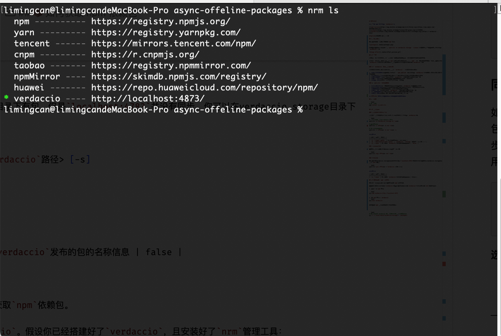
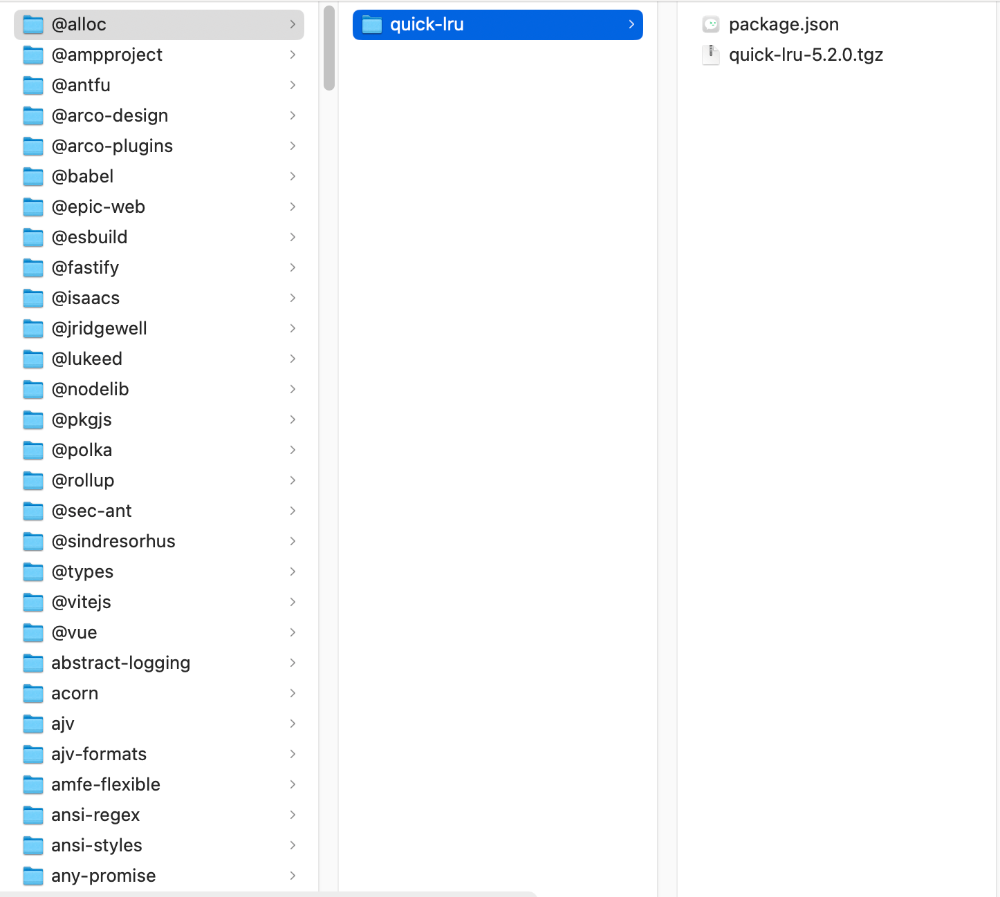

# SPTV-CLI

**Sync your npm packages to `verdaccio` with ease**


English | [中文](README_CN.md)

## 🎬 Demo Preview


**`sptv-cli` allows you to focus only on maintaining your dependencies for both internal and external networks.** 👉🏻 [How to get internal network publishable packages](#getPackages)

## 📦 Overview

In daily development, sometimes we work in environments with extremely high security requirements, which leads to the distinction between internal and external networks.

In internal network development, we cannot use `npm` to install dependencies, which causes great difficulties for our web development. So we need to set up `verdaccio` in the internal network environment and sync packages used in external network projects to the `verdaccio` built in the internal network.

### 🔴 Common Issues with Verdaccio Usage

In completely isolated internal and external network environments, we generally face the following issues when using `verdaccio`:

1. **Manual publishing is cumbersome**: Each package must be manually published to `verdaccio` using `npm publish`. When there are many packages, the workload is enormous, and the publication time is unpredictable.
2. `verdaccio` may not display packages that already exist, resulting in a poor user experience
3. **Complex dependency relationships**: Packages may have complex dependency relationships, and manual publishing is prone to omitting dependent packages
4. **Repetitive work**: Every project update requires manually republishing all related packages
5. **Low efficiency**: The entire process is time-consuming and labor-intensive, impacting development efficiency

Translated with DeepL.com (free version)
### ✅ Problems Solved by `sptv-cli`

1. **Automated Synchronization**: One-click automatic synchronization of external packages to internal Verdaccio, eliminating manual publishing
2. **Intelligent Dependency Scanning**: Automatically scans and identifies package dependencies, ensuring all dependent packages are synchronized
3. **Batch Processing**: Supports batch processing of multiple packages, greatly improving synchronization efficiency
4. **Version Consistency**: Ensures package versions in internal Verdaccio are completely consistent with external networks
5. **Progress Visualization**: Real-time display of synchronization progress, keeping users informed of operation status
6. **Flexible Configuration**: Supports multiple configuration options to adapt to different usage scenarios

## 🚀 Installation

```bash
# Install globally
npm install -g sptv-cli

# Or use npx
npx sptv-cli --help
```

## 📖 Usage

### Main Command (Full Workflow)

The main command performs a complete workflow: copy packages → scan for valid packages → sync to Verdaccio.

```bash
# Basic usage (uses current directory as source)
sptv-cli -d <verdaccio storage directory>

# Specify source directory
sptv-cli -i <source-directory> -d <verdaccio storage directory>

# Save package list to file
sptv-cli -i <source-directory> -d <verdaccio storage directory> -s
```

**Options:**

| Option | Description | Default |
|--------|-------------|---------|
| `-i, --input <path>` | Source directory containing packages | Current directory |
| `-d, --destination-path <path>` | Verdaccio storage directory path | - |
| `-s, --save` | Save package list to file | false |

### Copy Directory Command

You can use the copy function to copy a directory to another location.

```bash
sptv-cli copy <source-directory> <destination-directory>
```

### Sync Command

If you find that there are packages in the verdaccio storage directory but they are not synced on `localhost:4873`, you can use the `sync` function in the verdaccio storage directory.

```bash
sptv-cli sync <source-directory> <verdaccio storage directory> [-s]
```

**Options:**

| Option | Description | Default |
|--------|-------------|---------|
| `-s, --save` | Save the package list to file | false |

## <a id="getPackages">📦 How to get npm dependency packages</a> 

Here's a relatively good way for you to get npm dependency packages.

You need to set up `verdaccio` in an external network environment. Assuming you have already set up `verdaccio` and installed the `nrm` management tool:

1. Create a new npm source:

    ```bash
    nrm add verdaccio http://localhost:4873
    ```

2. Set the npm source to `verdaccio`
    ```bash
    nrm use verdaccio
    ```

At this point, your npm usage will look like this:


When you use `npm` or `pnpm` to download dependencies, the corresponding packages will be cached in the `storage` directory of `verdaccio`, and you can get a series of dependency packages that meet the conditions for publishing:



**Afterwards, you just need to focus on maintaining these packages and use `sptv-cli` to sync them to the internal network environment with one click**

### 📢 Note

If you find that packages are not cached in the verdaccio storage directory after using npm or pnpm to install dependencies, you can do the following before reinstalling:
- `npm cache clean -f`
- Delete the pnpm cache directory 