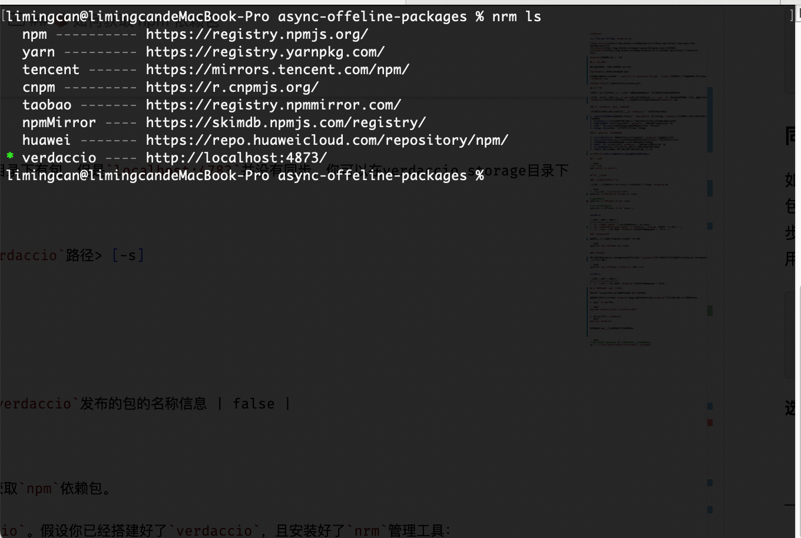

# SPTV-CLI

**轻松将 npm 包同步到 `verdaccio`**

[](https://www.npmjs.com/package/sptv-cli)
[](LICENSE)
[](https://verdaccio.org/)

[English](README.md) | 中文

## 🎬 效果预览


**`sptv-cli`让你只需要专注一维护好内外网的依赖包即可。** 👉🏻 [如何获得内网可发布的包](#📦-如何获取-npm-依赖包)

## 📦 概述

在日常开发中，有时我们在一些安全性要求极高的地方做开发，就会有内外网的区分。

在内网开发，我们没有办法使用`npm`安装依赖，这会对我们进行`web`开发造成极大的困扰。所以我们需要在内网环境中搭建`verdaccio`，并且把在外网项目中使用到的包，同步到内网搭建的`verdaccio`中。


### 🔴 `verdaccio` 日常使用的弊端

在内外网完全隔离的环境下，我们使用``verdaccio``一般会有以下弊端：

1. **手动发布繁琐**：需要将每个包通过 `npm publish` 手动发布到 `verdaccio`，包数量多时工作量巨大，且发布时间不可控
2. **依赖关系复杂**：包之间可能存在复杂的依赖关系，手动发布容易遗漏依赖包
3. **版本管理困难**：难以确保内网 `verdaccio` 中的包版本与外网保持一致
4. **重复性工作**：每次项目更新都需要重新手动发布所有相关包
6. **效率低下**：整个过程耗时耗力，影响开发效率

### ✅ `sptv-cli` 解决的问题

1. **自动化同步**：一键将外网包自动同步到内网 `verdaccio`，无需手动发布
2. **智能依赖扫描**：自动扫描并识别包之间的依赖关系，确保所有依赖包都被同步
3. **批量处理**：支持批量处理多个包，大大提高同步效率
4. **版本一致性**：确保内网 `verdaccio` 中的包版本与外网完全一致
6. **进度可视化**：实时显示同步进度，让用户清楚了解操作状态
7. **灵活配置**：支持多种配置选项，适应不同的使用场景

**`SPTV-CLI`可以让只需要更专注管理你的包就可以了**

## 🚀 安装

```bash
# 全局安装
npm install -g sptv-cli
```

## 📖 使用方法

### 主命令（完整工作流）

主命令执行完整的工作流：复制包 → 扫描有效包 → 同步到 `verdaccio`。

```bash
# 基本用法（使用当前目录作为源）
sptv-cli -d <verdaccio 的storage目录>

# 指定源目录
sptv-cli -i <源目录> -d <verdaccio 的storage目录>

# 输出同步后的信息
sptv-cli -i <源目录> -d <verdaccio 的storage目录> -s
```

**选项:**

| 选项 | 描述 | 默认值 |
|------|------|--------|
| `-i, --input <path>` | 包含包的源目录 | 当前目录 |
| `-d, --destination-path <path>` | `verdaccio` `storage` 文件夹所在路径 | - |
| `-s, --save` | 输出符合 `verdaccio`发布的包的名称信息 | `false` |

### 复制目录命令

你可以使用复制功能，将目录复制到另一个位置

```bash
sptv-cli copy <源目录> <目标目录>
```

### 同步命令

如果你发现verdaccio storage目录下有包，但是`localhost:4783`并没有同步，你可以在verdaccio storage目录下使用`sync`功能

```bash
sptv-cli sync <源目录> <verdaccio storage路径> [-s]
```

**选项:**

| 选项 | 描述 | 默认值 |
|------|------|--------|
| `-s, --save` | 输出符合 `verdaccio`发布的包的名称信息 | false |

## 📦 如何获取 `npm` 依赖包

这里有一个相对好的办法让你可以获取`npm`依赖包。

你需要在外网环境，搭建`verdaccio`。假设你已经搭建好了`verdaccio`，且安装好了`nrm`管理工具：

1. 新建一个`npm`源：

    ```bash
    nrm add verdaccio http://localhost:4873
    ```

2. 将`npm`源设为`verdaccio`
    ```bash
    nrm use verdaccio
    ```

此时你的`npm`使用情况将会是以下这样：


当你使用`npm`或者`pnpm`下载依赖时，对应的包就会被缓存到`verdaccio`的`storage`目录下，你就可以得到符合条件发布的一系列依赖包：


**后续你只要专注维护这些包，并使用`sptv-cli`一建同步到内网环境就可以了**

### 📢注意

当你用`npm`或者`pnpm`下载依赖后，发现包没有缓存到`verdaccio`的`storage`目录的话，你可以进行以下操作后，再重新安装依赖：
- `npm cache clean -f`
- 删除掉`pnpm`的缓存目录